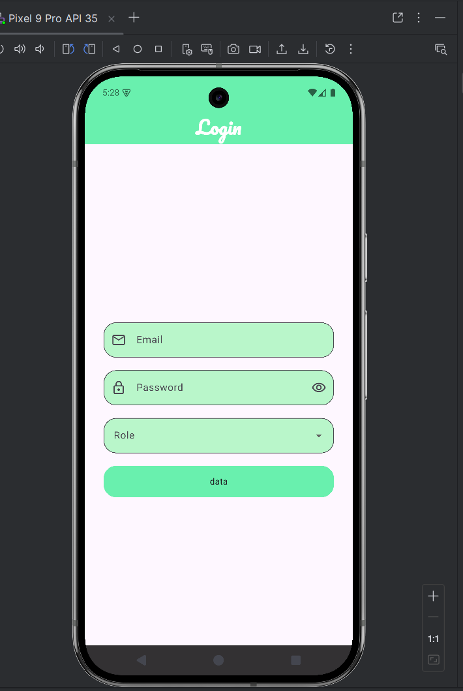
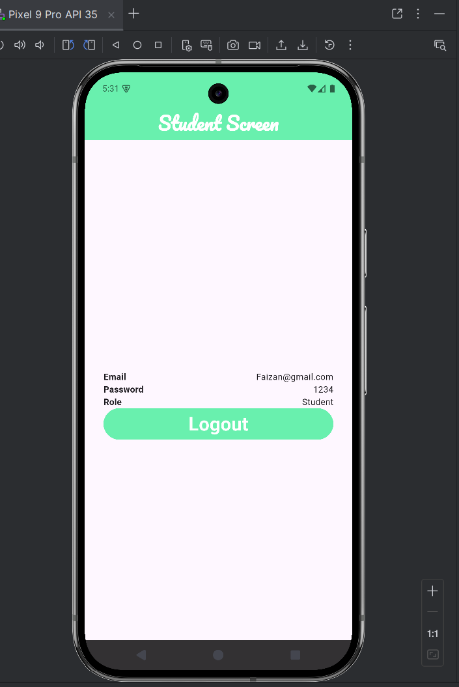

# Flutter SharedPreferences Role Demo

A Flutter demo application that demonstrates how to manage user sessions and role-based navigation using SharedPreferences.

This project is built to showcase app flow architecture, persistent local storage, and multi-role routing logic in Flutter.

---

## 📱 Features

- Splash screen session check
- Role-based navigation (Student / Teacher / Admin)
- Local session persistence using SharedPreferences
- Automatic routing based on saved login state
- Logout with session reset
- Clean UI and multi-screen architecture

---

## 🧠 Concept

The app simulates a login system where user data and selected role are stored locally using SharedPreferences.

On app launch:
- Splash screen checks stored session
- If session exists → user is routed to their role dashboard
- If no session → user is redirected to login

This demonstrates persistent session handling without external authentication services.

---

## 🛠 Tech Stack

- Flutter
- Dart
- SharedPreferences

---

## 📂 Project Structure


```
lib/
 ├── main.dart
 ├── splash_screen.dart
 ├── login_screen.dart
 ├── student_screen.dart
 ├── teacher_screen.dart
 ├── admin_screen.dart
android/
ios/
pubspec.yaml
```


---

## 📸 Screenshots

>/screenshots
├── login.png
└── student.png


| Login Screen               | Student Screen               |
|----------------------------|------------------------------|
|  |  |

---

## 🚀 How to Run the Project

1. Clone the repository:

```bash
git clone https://github.com/Dev-Muhammad-Faizan/Flutter-SharedPrefs-Multi-Role-App.git
```

2. Navigate to the project directory:

```bash
cd Flutter-SharedPrefs-Multi-Role-App
```

3. Install dependencies:

```bash
flutter pub get
```

4. Run the app:

```bash
flutter run
```

---
## 🚀 Learning Purpose

This project focuses on understanding:

- Persistent local storage
- Session management
- Role-based UI navigation
- App startup routing logic

---

## 👤 Author

Muhammad Faizan  
Flutter Developer
